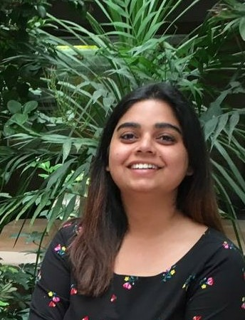

[Publications](publications.md)  |  [Awards and Grants](fellowship_and_grants.md)  | [Google Scholar](https://scholar.google.co.in/citations?user=c-S0ouYAAAAJ&hl=en) |[Twitter](https://twitter.com/ankita1shukla)

## About Me


I am a Postdoctoral researcher in [GML](https://pavanturaga.com/geometric-media-lab/), working with [Prof. Pavan Turaga](https://pavanturaga.com/) at Arizona State Univeristy. I defended my PhD in Oct, 2020 from IIIT-Delhi under the guidance of [Dr. Saket Anand](https://www.iiitd.edu.in/~anands/). My dissertation title is "Exploring Geometric Constraints for Learning Representations for Visual Data". During my PhD, I also worked as a visiting research scholar with [Prof. Pavan Turaga](https://pavanturaga.com/) for 6 months in 2019 (Feb - Aug) as well as during the summer of 2017.
I received my Master's degree from IIIT-Delhi. I was awarded Best Thesis Award for my thesis titled "Signal Processing Techniques to Reduce Energy Consumption in EEG Acquisition and Transmission for WBAN" under the guidance of [Dr. Angshul Majumdar](https://www.iiitd.edu.in/~angshul/index.htm).

My research interests lie in deep learning and machine learning approaches for visual and time series data, topological data analysis, differential geometry and geometry driven approaches for learning. From the applications point of view, I focus on AI for Good, specifically towards wildlife conservation and human health applications. 
<!---My work as a PhD student has two aspects. The first aspect focuses on leveraging semantic and geometric constraints for developing machine learning and deep learning algorithms. This includes distance metric learning in traditional machine learning, as well as current work that focuses on geometry aware deep learning. The other aspect focuses on AI for Good, specifically towards visual wildlife monitoring applications.>
<!---My work as a PhD students spans --->


## Contact Me 
Reach me at [ashukl20@asu.edu](ashukl20@asu.edu) or [ankitas@iiitd.ac.in](ankitas@iiitd.ac.in)

## Updates and News

- Organizing the [DiffCVML 2020](http://diffcvml.org/2020/) Workshop, held in conjunction with [CVPR 2020](http://cvpr2020.thecvf.com/).  
- Recieved travel grant from [WiML 2019](https://wimlworkshop.org/2019/) to present my work titled "Ignorance is Bliss: Semantic Pairing for Fine-grained Visual Recognition" in the workshop. 
- Paper titled "A hybrid approach for tiger re-identification" is accepted at [Computer Vision for Wildlife Conservation Workshop](https://cvwc2019.github.io/) in challenge paper track at ICCV 2019.  
- "Paper titled "PrOSe: Product of Orthogonal Spheres Parameterization for Disentangled Representation Learning" is accepted to BMVC 2019.
- Paper titled ”Primate Identification in the Wild” accepted to PRICAI 2019.
- Work titled “Geometry of Deep Generative Models for learning Disentangled Representations” accepted as poster at  workshop WiCV 2019 organized in CVPR 2019.
- Selected to attend the NSF-CBMS Conference on Topological Methods in Machine Learning and Artificial Intelligence.


<!---

```markdown
Syntax highlghted c ode block

# About Me
## Header 2
### Header 3

- Bulleted
- List

1. Numbered
2. List

**Bold** and _Italic_ and `Code` text

[Link](url) and 
```

For more details see [GitHub Flavored Markdown](https://guides.github.com/features/mastering-markdown/).

### Jekyll Themes

Your Pages site will use the layout and styles from the Jekyll theme you have selected in your [repository settings](https://github.com/ankita-shukla/ankita-shukla.github.io/settings). The name of this theme is saved in the Jekyll `_config.yml` configuration file.

### Support or Contact

Having trouble with Pages? Check out our [documentation](https://help.github.com/categories/github-pages-basics/) or [contact support](https://github.com/contact) and we’ll help you sort it out.--->
