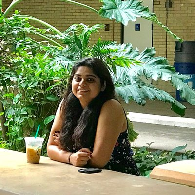

 [Research](research.md)    |    [Awards and Grants](fellowship_and_grants.md)

## About Me


I am a PhD student at IIIT-Delhi in ECE Department. I am advised by [Dr. Saket Anand](https://www.iiitd.edu.in/~anands/). I am working as a research intern with [Prof. Pavan Turaga](https://pavanturaga.com/) for 6 months (Feb - Aug 2019) and previously interned with him during Summer 2017 in the [Geometric Media Lab](https://pavanturaga.com/geometric-media-lab/), Arizona State University, USA.

I received my Master's degree from IIIT-Delhi. I was awarded Best Thesis Award for my thesis titled "Signal Processing Techniques to Reduce Energy Consumption in EEG Acquisition and Transmission for WBAN" under the guidance of [Dr. Angshul Majumdar](https://www.iiitd.edu.in/~angshul/index.htm).

My research interests lie in deep learning and machine learning approaches for computer vision applications, topological data analysis, differential geometry and geometry driven approaches for learning. My work as a PhD student has two aspects. The first aspect focuses on leveraging semantic and geometric constraints for developing machine learning and deep learning algorithms. This includes distance metric learning in traditional machine learning, as well as current work that focuses on geometry aware deep learning. The other aspect focuses on AI for Good, specifically towards visual wildlife monitoring applications.
<!---My work as a PhD students spans --->


## Updates and News

- Paper titled ”Primate Identification in the Wild” accepted to PRICAI 2019.
- Work titled “Geometry of Deep Generative Models for learning Disentangled Representations” accepted as poster at  workshop WiCV 2019 organized in CVPR 2019.
- Selected to attend the NSF-CBMS Conference on Topological Methods in Machine Learning and Artificial Intelligence.

## arXiv Submissions

  - [Unique Identification of Macaques for Population Monitoring and Control](https://arxiv.org/abs/1811.00743)  
    **Ankita Shukla**\*, Gullal Singh Cheema\*, Saket Anand, Qamar Qureshi, Yadvendradev Jhala  
    arXiv preprint arXiv:1811.00743 (2018)
    (\*Equal Contribution)
    
  - [Semi-Supervised Clustering with Neural Networks](https://www.google.com/url?sa=t&rct=j&q=&esrc=s&source=web&cd=1&cad=rja&uact=8&ved=2ahUKEwiz5ci4uIPjAhXQvJ4KHd6oCPcQFjAAegQIAxAB&url=https%3A%2F%2Farxiv.org%2Fabs%2F1806.01547&usg=AOvVaw3Vh22r2Rzyo98I2a5dEFna)  
    **Ankita Shukla**\*, Gullal Singh Cheema\*, Saket Anand  
    arXiv preprint arXiv:1806.01547 (2018)
    (\*Equal Contribution)


## Publications  
### 2019
  - Primate Face Identification in the Wild (link coming soon!)  
    **Ankita Shukla**\*, Gullal Singh Cheema\*, Saket Anand, Qamar Qureshi, Yadvendradev Jhala  
    (PRICAI 2019)
    (\*Equal Contribution)
  
### 2018 
  - [Geometry of Deep Generative Models for Disentangled Representations](https://arxiv.org/pdf/1902.06964.pdf)  
    **Ankita Shukla**, Shagun Uppal, Sarthak Bhagat, Saket Anand, Pavan Turaga    
    (ICVGIP 2018)
    
  - [Perturbation Robust Representations of Topological Persistence Diagrams](http://openaccess.thecvf.com/content_ECCV_2018/papers/Anirudh_Som_Perturbation_Robust_Representations_ECCV_2018_paper.pdf)  
    Anirudh Som, Kowshik Thopalli, K. N. Ramamurthy, V. Venkataraman, **Ankita Shukla**, Pavan Turaga  
    (ECCV 2018)
 
### 2017
 - [Metric Learning on Biological Sequence Embeddings](http://ieeexplore.ieee.org/document/8227769/)  
   Dhananjay Kimothi, **Ankita Shukla**, Pravesh Biyani, Saket Anand, James M. Hogan  
   IEEE International Workshop on Signal Processing Advances in Wireless Communications (SPAWC 2017)

### 2016 
 - [Metric Learning based Automatic Segmentation of Patterned Species](https://www.iiitd.edu.in/~anands/files/papers/ml_seg_icip2016.pdf)  
   **Ankita Shukla**, Saket Anand  
   International Conference on Image Processing (ICIP 2016)

### 2015
 - [Distance Metric Learning by Optimization on the Stiefel Manifold](http://www.bmva.org/bmvc/2015/diffcv/papers/paper007/paper007.pdf) (Best Student Paper)  
   **Ankita Shukla**, Saket Anand  
   Differential Geometry in Computer Vision (in conjunction with BMVC 2015)
   
 - [Combining Sparsity with Rank Deficiency for Energy Efficient EEG Sensing
   and Transmission over Wireless Body Area Network](http://ieeexplore.ieee.org/stamp/stamp.jsp?tp=&arnumber=7178087)  
   Angshul Majumdar, **Ankita Shukla**, Rabab Ward  
   International Conference on Acoustics, Speech and Signal Processing (ICASSP 2015)

 - [Exploiting Inter-channel Correlation in EEG Signal Reconstruction](https://www.sciencedirect.com/science/article/pii/S1746809414001694)  
   **Ankita Shukla**, Angshul Majumdar  
   Biomedical Signal Processing and Control 2015
   
 - [A Kronecker Compressed Sensing formulation for energy efficient EEG sensing](https://ieeexplore.ieee.org/stamp/stamp.jsp?arnumber=7050682)  
   **Ankita Shukla**, Angshul Majumdar, Rabab Ward  
   (ICAPR 2015)
   
 - [Row-sparse blind compressed sensing for reconstructing multi-channel EEG signals](https://www.sciencedirect.com/science/article/pii/S1746809414001359)    
   **Ankita Shukla**, Angshul Majumdar  
   Biomedical Signal Processing and Control 2015

   
   

### 2014
 - [Split Bregman Algorithms for Sparse/Joint-sparse and Low rank Signal Recovery: Application 
   in Compressive  Hyperspectral Imaging](http://ieeexplore.ieee.org/stamp/stamp.jsp?tp=&arnumber=7025260)  
   Anupriya Gogna, **Ankita Shukla**, Hemant Kumar Aggarwal, Angshul Majumdar  
   IEEE International Conference on Image Processing (ICIP 2014)

 - [Energy Efficient Acquisition and Reconstruction of EEG Signals](https://www.ncbi.nlm.nih.gov/pubmed/25570198)      
   Wazir Singh, **Ankita Shukla**, Sujay Deb, Angshul Majumdar  
   IEEE Engineering in Machine and Biology Conference (EMBC 2014)

 - [Matrix Recovery using Split Bregman](https://arxiv.org/abs/1312.6872)  
   Anupriya Gogna, **Ankita Shukla**, Angshul Majumdar  
   22nd International Conference on Pattern Recognition (ICPR 2014)
   
### 2013
 - [Real-Time Dynamic MRI Reconstruction:
   Accelerating Compressed Sensing on Graphical Processor Unit](https://www.actapress.com/Abstract.aspx?paperId=455711)  
   **Ankita Shukla**, Anghsul Majumdar, Rabab Ward  
   IASTED Signal and Image Processing 2013


   
    


<!---

```markdown
Syntax highlghted code block

# About Me
## Header 2
### Header 3

- Bulleted
- List

1. Numbered
2. List

**Bold** and _Italic_ and `Code` text

[Link](url) and 
```

For more details see [GitHub Flavored Markdown](https://guides.github.com/features/mastering-markdown/).

### Jekyll Themes

Your Pages site will use the layout and styles from the Jekyll theme you have selected in your [repository settings](https://github.com/ankita-shukla/ankita-shukla.github.io/settings). The name of this theme is saved in the Jekyll `_config.yml` configuration file.

### Support or Contact

Having trouble with Pages? Check out our [documentation](https://help.github.com/categories/github-pages-basics/) or [contact support](https://github.com/contact) and we’ll help you sort it out.--->
